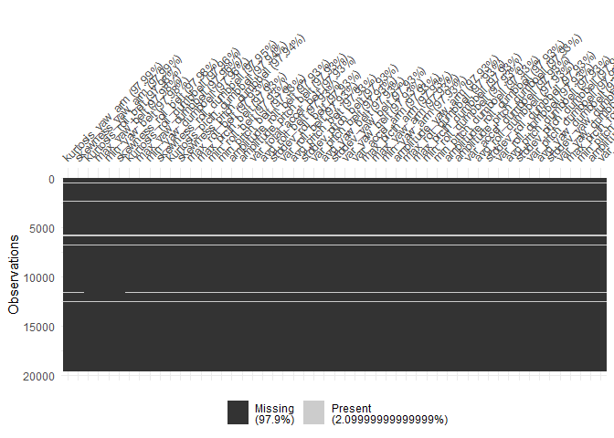
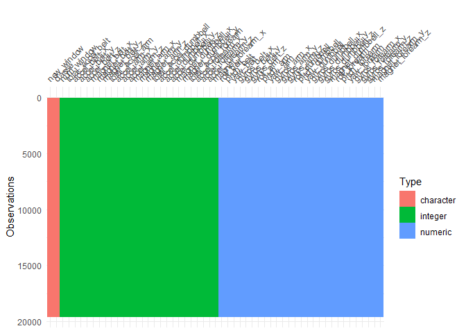
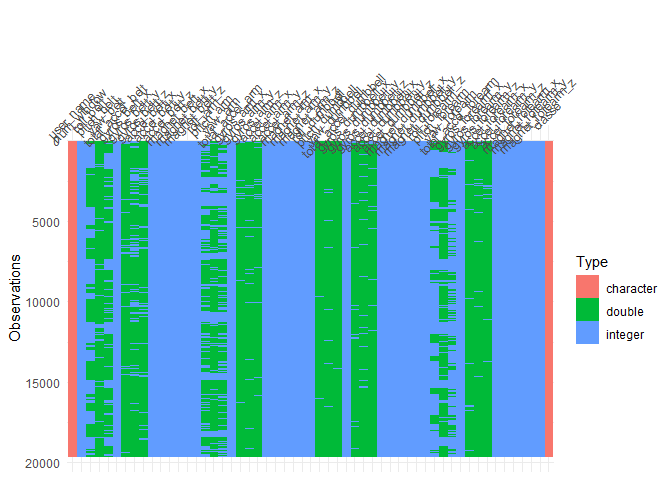

First step: Load required packages.


```r
library("dplyr")
library("caret")
library("mlr")
library("visdat")
```

Load data and set seed:


```r
df <- read.csv("1_data/pml-training.csv", na.strings = c("NA", "NaN", "", "#DIV/0!"), row.names = 1)

set.seed(31)
```


# 1. Inspect target variable
First, I am looking at the target variable "classe":


```r
# What is "classe"?
glimpse(df$classe)
```

```
##  Factor w/ 5 levels "A","B","C","D",..: 1 1 1 1 1 1 1 1 1 1 ...
```

Since it is a categorical variable, it is a classification problem. Hence, an algorithm like logistic regression, random forests, or a similar algorithm is suitable. 

# 2. Clean the data set
Remove obvious non-predictive variables:

```r
df %>% select(-c(raw_timestamp_part_1, raw_timestamp_part_2, cvtd_timestamp)) -> df
```

Remove zero variance/near zero variance predictors

```r
nzv <- nearZeroVar(df)
df <- df[-nzv]

df <- removeConstantFeatures(df, perc = .02)
```

```
## Removing 12 columns: kurtosis_picth_belt,skewness_roll_belt.1,kurtosis_roll_arm,kurtosis_picth_arm,skewness_roll_arm,skewness_pitch_arm,kurtosis_roll_forearm,kurtosis_picth_forearm,skewness_roll_forearm,skewness_pitch_forearm,max_yaw_forearm,min_yaw_forearm
```

Remove predictors with mostly NAs:

```r
df %>%
  select(everything()) %>%
  summarise_all(funs(sum(is.na(.)) / length(.))) -> p

# check these variables
vis_miss(df[which(p > 0.975)],
  sort_miss = TRUE, warn_large_data = F
)
```

<!-- -->

```r
# remove them if sensible
df[which(p > 0.975)] <- NULL
```

Remove highly correlated predictors

```r
nums <- select_if(df, is.numeric)
descrCor <- cor(nums)

highCorr <- sum(na.omit(abs(descrCor[upper.tri(descrCor)])) >= .98)

na.omit(descrCor[upper.tri(descrCor)])[which(na.omit(abs(descrCor[upper.tri(descrCor)])) >= .98, arr.ind = TRUE)]
```

```
## [1]  0.9809241 -0.9920085
```

```r
which(na.omit(abs(descrCor)) >= .98 & na.omit(abs(descrCor)) < 1, arr.ind = TRUE)
```

```
##                  row col
## total_accel_belt   5   2
## accel_belt_z      11   2
## roll_belt          2   5
## roll_belt          2  11
```

```r
findCorrelation(na.omit(descrCor), cutoff = .98, verbose = T, exact = T, names = T)
```

```
## Compare row 11  and column  2 with corr  0.992 
##   Means:  0.266 vs 0.165 so flagging column 11 
## Compare row 2  and column  5 with corr  0.981 
##   Means:  0.247 vs 0.161 so flagging column 2 
## All correlations <= 0.98
```

```
## [1] "accel_belt_z" "roll_belt"
```

There are two variables with high correlation --> consider in model evaluation! I will leave them in the dataset for this time.

Find linear combinations:

```r
findLinearCombos(nums)
```

```
## $linearCombos
## list()
## 
## $remove
## NULL
```

Visualize the data:

```r
vis_dat(df, warn_large_data = F)
```

<!-- -->

Are mixed data types in one variable?

```r
vis_guess(df)
```

<!-- -->

Plot the features:

```r
nums <- unlist(lapply(df, is.numeric))
featurePlot(x = df[nums], y = df$classe, plot = "strip")
```

<!-- -->

Save the cleaned data

```r
saveRDS(df, "1_data/cleaned_data.rds")
```


# 3. Training
The training is run on an Amazon AWS EC2 t2.2xlarge instance. More details on the environment:


## Task

```r
task <- makeClassifTask(id = "nike", data = df, target = "classe")
```

## Resampling
I chose to use a nested cross validation strategy with a 5-fold inner cross validation and a 3-fold outer cross validation. The evaluation of the tuned learners is performed by 5-fold cross validation. 

```r
# Inner resampling
rdesc.inner <- makeResampleDesc("CV", iters = 5)
```

The best parameter combination is then evaluated against the remaining fold of the 3-fold outer cross validation.

```r
# Outer resampling
rdesc.outer <- makeResampleDesc(method = "CV", iters = 3)
resample.instance.outer <- makeResampleInstance(desc = rdesc.outer, task = task)
```

## Measures

```r
measures <- list(mmce)
```

## Learners
### Random forest

```r
lrn.rndforest <- makePreprocWrapperCaret("classif.randomForest", ppc.center = T, ppc.scale = T)

ps.rndforest <- makeParamSet(
  makeIntegerParam("ntree", lower = 100, upper = 1000),
  makeIntegerParam("mtry", lower = 5, upper = 20)
  # makeLogicalParam("ppc.center"),
  # makeLogicalParam("ppc.scale")
)

tune.ctrl.rndforest <- makeTuneControlRandom(maxit = 30)

tuned.lrn.rndforest <- makeTuneWrapper(lrn.rndforest,
  par.set = ps.rndforest,
  resampling = rdesc.inner,
  control = tune.ctrl.rndforest
)
```

### Xgboost

```r
lrn.xgboost <- makePreprocWrapperCaret("classif.xgboost", ppc.center = T, ppc.scale = T)

ps.xgboost <- makeParamSet(
  makeNumericParam("eta", lower = 0, upper = 0.5),
  makeNumericParam("colsample_bytree", lower = 0.5, upper = 0.9),
  makeNumericParam("gamma", lower = 0, upper = 2),
  makeIntegerParam("max_depth", lower = 4, upper = 10),
  makeIntegerParam("nrounds", lower = 500, upper = 1500)
)

tune.ctrl.xgboost <- makeTuneControlRandom(maxit = 30)

tuned.lrn.xgboost <- makeTuneWrapper(lrn.xgboost,
  par.set = ps.xgboost,
  resampling = rdesc.inner,
  control = tune.ctrl.xgboost
)
```

### Ranger

```r
lrn.ranger <- makePreprocWrapperCaret("classif.ranger", ppc.center = T, ppc.scale = T)
```

### Gbm

```r
lrn.gbm <- makePreprocWrapperCaret("classif.gbm", ppc.center = T, ppc.scale = T)

ps.gbm <- makeParamSet(
  makeIntegerParam("n.trees", lower = 100, upper = 1000),
  makeIntegerParam("interaction.depth", lower = 5, upper = 20),
  makeNumericParam("shrinkage", lower = 0, upper = 0.2)
)

tune.ctrl.gbm <- makeTuneControlRandom(maxit = 30)

tuned.lrn.gbm <- makeTuneWrapper(lrn.gbm,
  par.set = ps.gbm,
  resampling = rdesc.inner,
  control = tune.ctrl.gbm
)
```

## Benchmark
Compare the leaners' performance:

```r
bm <- benchmark(
  learners = list(
    tuned.lrn.rndforest,
    tuned.lrn.xgboost,
    lrn.ranger,
    tuned.lrn.gbm
  ),
  tasks = task,
  resamplings = resample.instance.outer,
  measures = measures
)
```

```r
# readRDS("bm.rds")
```

```r
plotBMRBoxplots(bm)
```

```r
# readRDS("plots.rds")
```

XXX seems to be the best learner for this problem.

# 4. Train final model

```r
# choose best learner:
model <- mlr::train(learner = , task = task)

save(list = model, file = "my_final_model.rds")

# load("my_final_model.rds")
```

# 5. Predict new data
## Load new data

```r
testing <- read.csv("1_data/pml-testing.csv", na.strings = c("NA", "NaN", "", "#DIV/0!"), row.names = 1)

# make sure that they have the same columns (except target)
df %>%
  select(-classe) %>%
  colnames() -> vars

testing <- testing[vars]
```

## Prediction

```r
pred <- predict(model, newdata = testing)
```
