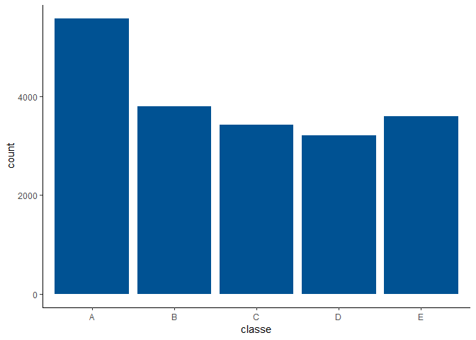
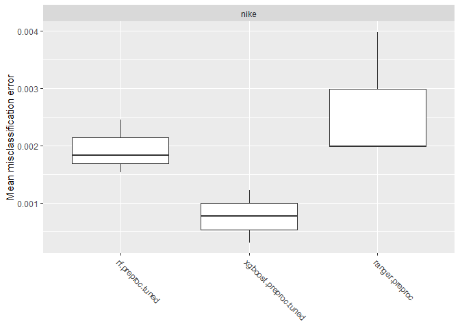

# Background

Going to the gym, whether to boost your health, to lose weight, or simply because it is fun, is certainly a worthwile activity. [FiveThirtyEight](https://fivethirtyeight.com/features/its-easier-than-ever-to-get-the-recommended-amount-of-exercise/) recently reported that according to the latest *Physical Activity Guidelines for Americans*, every form of activity counts. However, if you have eager goals, not only quantity but also quality and being efficient matters. In this project, I predict whether a certain exercise, a barbell lift, was well or sloppily executed on the basis of data obtained from accelerometers on the belt, forearm, arm, and dumbell of six participants. The participants performed the exercises correctly and incorrectly in five different ways. The idea for this analysis stems from the Coursera course *Practical Machine Learning* by Johns Hopkins University. The data for this project come from [http://groupware.les.inf.puc-rio.br/har](http://groupware.les.inf.puc-rio.br/har).

# Analysis

The first step is to load all required packages:


```r
library("dplyr")
library("caret")
library("mlr")
library("visdat")
library("data.table")
```

Then I load the data set with the speedy `fread()` function of `data.table` and set a seed for reproducibility.


```r
df <- fread("1_data/pml-training.csv", na.strings = c("NA", "NaN", "", "#DIV/0!"), drop = 1)

set.seed(31)
```

# 1. Inspect the target variable
First, I am looking at the target variable `classe`. What type is it, how many "classes" are there in the data set?


```r
glimpse(df$classe)
```

```
##  chr [1:19622] "A" "A" "A" "A" "A" "A" "A" "A" "A" "A" "A" "A" "A" "A" ...
```

Since it is a categorical variable, the analysis represents a classification problem. Hence, an algorithm like logistic regression or random forest is suitable. Let's check if the classes are balanced:


```r
ggplot(df, aes(x = classe)) +
  geom_bar(stat = "count", fill = "#005293") +
  theme_classic()
```

<!-- -->

```r
count(df, classe)
```

```
## # A tibble: 5 x 2
##   classe     n
##   <chr>  <int>
## 1 A       5580
## 2 B       3797
## 3 C       3422
## 4 D       3216
## 5 E       3607
```

The classes seem to be pretty balanced. This will make cross-validation and performance evaluation a bit easier.

# 2. Clean the data set

First, I remove obviously non-predictive features such as `user_name`.

```r
df %>% select(-c(raw_timestamp_part_1, raw_timestamp_part_2, cvtd_timestamp, user_name)) -> df
```

Next, I am looking for zero variance/near zero variance features and remove them afterwards.

```r
nzv <- nearZeroVar(df)
df <- df[ , -..nzv]

df <- removeConstantFeatures(as.data.frame(df), perc = .02)
```

```
## Removing 12 columns: kurtosis_picth_belt,skewness_roll_belt.1,kurtosis_roll_arm,kurtosis_picth_arm,skewness_roll_arm,skewness_pitch_arm,kurtosis_roll_forearm,kurtosis_picth_forearm,skewness_roll_forearm,skewness_pitch_forearm,max_yaw_forearm,min_yaw_forearm
```

The same goes for features that contain mostly NAs. I chose a cut-off of 97.5%, i.e. I remove a feature if 97.5% or more of its cases are NA. Before I mindlessly discard these predictors, I am having a closer look at them – cut-offs are comfortable but may be nonsensical sometimes.


```r
df %>%
  select(everything()) %>%
  summarise_all(funs(sum(is.na(.)) / length(.))) -> p
```

```
## Warning: funs() is soft deprecated as of dplyr 0.8.0
## Please use a list of either functions or lambdas: 
## 
##   # Simple named list: 
##   list(mean = mean, median = median)
## 
##   # Auto named with `tibble::lst()`: 
##   tibble::lst(mean, median)
## 
##   # Using lambdas
##   list(~ mean(., trim = .2), ~ median(., na.rm = TRUE))
## This warning is displayed once per session.
```

```r
# check these variables
vis_miss(df[which(p > 0.975)],
  sort_miss = TRUE, warn_large_data = F
)
```

<!-- -->

```r
# remove them if sensible
df[which(p > 0.975)] <- NULL
```

Highly correlated features contain mostly the same information. Hence, keeping both does not have any value at best and hurts fitting the model at worst. I am looking for features that are highly correlated for this reason and discard them if it seems sensible. 


```r
nums <- select_if(df, is.numeric)
descrCor <- cor(nums)

highCorr <- sum(na.omit(abs(descrCor[upper.tri(descrCor)])) >= .98)

na.omit(descrCor[upper.tri(descrCor)])[which(na.omit(abs(descrCor[upper.tri(descrCor)])) >= .98, arr.ind = TRUE)]
```

```
## [1]  0.9809241 -0.9920085
```

```r
which(na.omit(abs(descrCor)) >= .98 & na.omit(abs(descrCor)) < 1, arr.ind = TRUE)
```

```
##                  row col
## total_accel_belt   5   2
## accel_belt_z      11   2
## roll_belt          2   5
## roll_belt          2  11
```

```r
findCorrelation(na.omit(descrCor), cutoff = .98, verbose = T, exact = T, names = T)
```

```
## Compare row 11  and column  2 with corr  0.992 
##   Means:  0.266 vs 0.165 so flagging column 11 
## Compare row 2  and column  5 with corr  0.981 
##   Means:  0.247 vs 0.161 so flagging column 2 
## All correlations <= 0.98
```

```
## [1] "accel_belt_z" "roll_belt"
```

There are two variables with a very high correlation. I will leave them in the dataset for this time, but performing the rest of the analysis without them is certainly an interesting alley to go down.

The `mlr` package provides a similar, more concise function:

```r
findLinearCombos(nums)
```

```
## $linearCombos
## list()
## 
## $remove
## NULL
```

# 3. Visualize the data

Time to take a step back and to have a look at the result of these cleaning steps. 


```r
vis_dat(df, warn_large_data = F)
```

<!-- -->

Let's see if there are mixed data types within a single feature.

```r
vis_guess(df)
```

<!-- -->

Plotting the relationship of the features with the target, `classe`, yields a first glimpse on potentially meaningful features. 

```r
nums <- unlist(lapply(df, is.numeric))
featurePlot(x = as.data.frame(df)[nums], y = df$classe, plot = "strip")
```
<figure>
  
</figure>

Looks fine, let's save the progress! We can now tinker around with a clean data set and can always return back to this state.

```r
saveRDS(df, "1_data/cleaned_data.rds")
```

# 4. Training
Since the training is a bit computational heavy, I outsourced this step and brought an Amazon AWS EC2 t2.2xlarge instance into play. I performed the training steps shown down below on this instance and then transferred the results to my own machine. Here are the details on its environment:

```
## R version 3.6.0 (2019-04-26)
## Platform: x86_64-w64-mingw32/x64 (64-bit)
## Running under: Windows Server x64 (build 17763)
## 
## Matrix products: default
## 
## locale:
## [1] LC_COLLATE=English_United States.1252 
## [2] LC_CTYPE=English_United States.1252   
## [3] LC_MONETARY=English_United States.1252
## [4] LC_NUMERIC=C                          
## [5] LC_TIME=English_United States.1252    
## 
## attached base packages:
## [1] stats     graphics  grDevices utils     datasets  methods   base     
## 
## other attached packages:
## [1] visdat_0.5.3      mlr_2.14.0        ParamHelpers_1.12 caret_6.0-84     
## [5] ggplot2_3.1.1     lattice_0.20-38   dplyr_0.8.1      
## 
## loaded via a namespace (and not attached):
##  [1] gbm_2.1.5           tidyselect_0.2.5    purrr_0.3.2        
##  [4] reshape2_1.4.3      splines_3.6.0       colorspace_1.4-1   
##  [7] generics_0.0.2      stats4_3.6.0        survival_2.44-1.1  
## [10] XML_3.98-1.19       prodlim_2018.04.18  rlang_0.3.4        
## [13] ModelMetrics_1.2.2  pillar_1.4.0        glue_1.3.1         
## [16] withr_2.1.2         xgboost_0.82.1      foreach_1.4.4      
## [19] plyr_1.8.4          lava_1.6.5          stringr_1.4.0      
## [22] timeDate_3043.102   munsell_0.5.0       gtable_0.3.0       
## [25] recipes_0.1.5       codetools_0.2-16    parallelMap_1.4    
## [28] parallel_3.6.0      class_7.3-15        Rcpp_1.0.1         
## [31] scales_1.0.0        backports_1.1.4     checkmate_1.9.3    
## [34] ipred_0.9-9         gridExtra_2.3       fastmatch_1.1-0    
## [37] ranger_0.11.2       stringi_1.4.3       BBmisc_1.11        
## [40] grid_3.6.0          tools_3.6.0         magrittr_1.5       
## [43] lazyeval_0.2.2      tibble_2.1.1        randomForest_4.6-14
## [46] crayon_1.3.4        pkgconfig_2.0.2     MASS_7.3-51.4      
## [49] Matrix_1.2-17       data.table_1.12.2   lubridate_1.7.4    
## [52] gower_0.2.1         assertthat_0.2.1    iterators_1.0.10   
## [55] R6_2.4.0            rpart_4.1-15        nnet_7.3-12        
## [58] nlme_3.1-139        compiler_3.6.0
```

## Task
What do we want our machine to learn? I first need to specify the data set and the target for prediction, here `classe`. In the `mlr` package, this is done by defining a task:

```r
task <- makeClassifTask(id = "fitness.tracker", data = df, target = "classe")
```

## Resampling
I chose to use a nested cross-validation strategy with a 5-fold inner cross-validation plan and a 3-fold outer cross-validation plan. Following the 3-fold outer cross-valdation plan, the data set is first split into 3 folds. Evaluation of the test error and hyperparameter tuning are performed using two of these folds by 5-fold cross-validation, the inner cross-validation plan:

```r
rdesc.inner <- makeResampleDesc("CV", iters = 5)
```

The best parameter combination is then evaluated against the remaining fold of the 3-fold outer cross-validation plan:

```r
rdesc.outer <- makeResampleDesc(method = "CV", iters = 3)
resample.instance.outer <- makeResampleInstance(desc = rdesc.outer, task = task)
```

The [mlr homepage](https://mlr.mlr-org.com/index.html) provides a great graphical representation of this strategy [here](https://mlr.mlr-org.com/articles/tutorial/nested_resampling.html).

<figure style="width: 75%; margin: 0 auto;">
  
  <figcaption style="width: 100%; margin: 0 auto;">Note that the illustrated strategy uses a different number of folds. </figcaption>
</figure>

## Measures
Since it is a classification problem and the classes seem to be balanced, I chose the mean misclassification error to evaluate the learners' performance. Other metrics, such as accuracy or F1-score, would also have been suitable and are easy to add if necessary.

```r
measures <- list(mmce)
```

## Learners
I compare the performance of three different learners: a random forest, XGBoost (a gradient boosting algorithm), and a ranger (a fast implementation of random forests). Each learner's hyperparameters are tuned in the cross-validation process. For preprocessing, I center and scale the features. Here are the leaners' instantiations:

### Random forest

```r
lrn.rndforest <- makePreprocWrapperCaret("classif.randomForest", ppc.center = T, ppc.scale = T)

ps.rndforest <- makeParamSet(
  makeIntegerParam("ntree", lower = 100, upper = 1000),
  makeIntegerParam("mtry", lower = 5, upper = 20)
)

tune.ctrl.rndforest <- makeTuneControlRandom(maxit = 30)

tuned.lrn.rndforest <- makeTuneWrapper(lrn.rndforest,
  par.set = ps.rndforest,
  resampling = rdesc.inner,
  control = tune.ctrl.rndforest
)
```

### XGBoost

```r
lrn.xgboost <- makePreprocWrapperCaret("classif.xgboost", ppc.center = T, ppc.scale = T)
```

```
## Warning in makeParam(id = id, type = "numeric", learner.param = TRUE, lower = lower, : NA used as a default value for learner parameter missing.
## ParamHelpers uses NA as a special value for dependent parameters.
```

```r
ps.xgboost <- makeParamSet(
  makeNumericParam("eta", lower = 0, upper = 0.5),
  makeNumericParam("colsample_bytree", lower = 0.5, upper = 0.9),
  makeNumericParam("gamma", lower = 0, upper = 2),
  makeIntegerParam("max_depth", lower = 4, upper = 10),
  makeIntegerParam("nrounds", lower = 500, upper = 1500)
)

tune.ctrl.xgboost <- makeTuneControlRandom(maxit = 30)

tuned.lrn.xgboost <- makeTuneWrapper(lrn.xgboost,
  par.set = ps.xgboost,
  resampling = rdesc.inner,
  control = tune.ctrl.xgboost
)
```

### Ranger

```r
lrn.ranger <- makePreprocWrapperCaret("classif.ranger", ppc.center = T, ppc.scale = T)
```

## Benchmark
Let's see how well each learner does!

```r
bm <- benchmark(
  learners = list(
    tuned.lrn.rndforest,
    tuned.lrn.xgboost,
    lrn.ranger
  ),
  tasks = task,
  resamplings = resample.instance.outer,
  measures = measures
)

bm
```


```r
plotBMRBoxplots(bm)
```

<!-- -->

The XGBoost algorithm seems to do the best job here. Thus, I concentrate on this learner and go on with extended hyperparameter tuning. Next, I train the final model on the complete training data set and discard all others but the best performing hyperparameter set. 

# 4. Train final model

```r
model <- mlr::train(learner = tuned.lrn.xgboost, task = task)

saveRDS(model, "1_data/model.rds")
```


# 5. Predict the test data
The last step of this analysis is to predict a small, completely new, and independent test set. First step again is to load the test data.

## Load and prepare test data

```r
testing <- read.csv("1_data/pml-testing.csv", na.strings = c("NA", "NaN", "", "#DIV/0!"), row.names = 1)

# make sure that they have the same columns (except the target)
df %>%
  select(-classe) %>%
  colnames() -> vars

testing <- testing[vars]
```

## Prediction
I use the model trained above to predict the 20 cases in this final test set. 

```r
pred <- predict(model, newdata = testing)
```

Let's see how we did here:

```
##    response true_labels correct_prediction
## 1         B           B                yes
## 2         A           A                yes
## 3         B           B                yes
## 4         A           A                yes
## 5         A           A                yes
## 6         E           E                yes
## 7         D           D                yes
## 8         B           B                yes
## 9         A           A                yes
## 10        A           A                yes
## 11        B           B                yes
## 12        C           C                yes
## 13        B           B                yes
## 14        A           A                yes
## 15        E           E                yes
## 16        E           E                yes
## 17        A           A                yes
## 18        B           B                yes
## 19        B           B                yes
## 20        B           B                yes
```

Seems like the learner did a great job! It predicted every case correctly. Yay! :)
